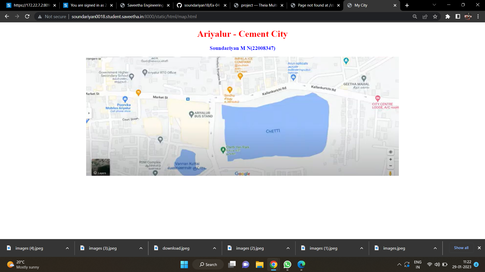
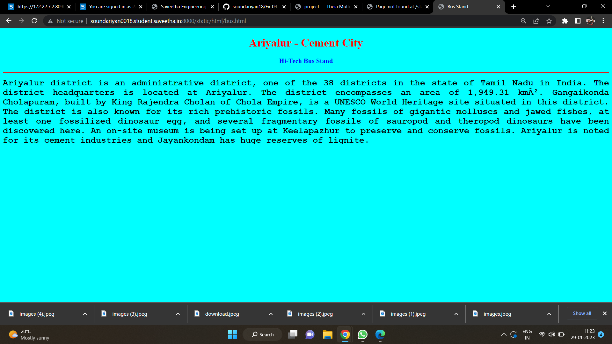
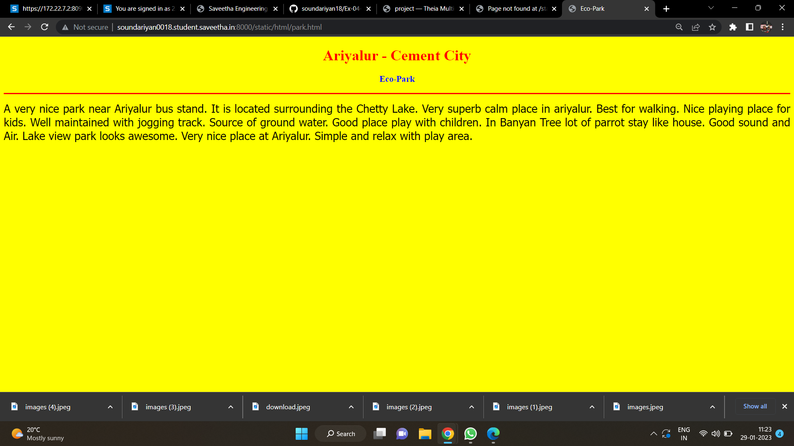
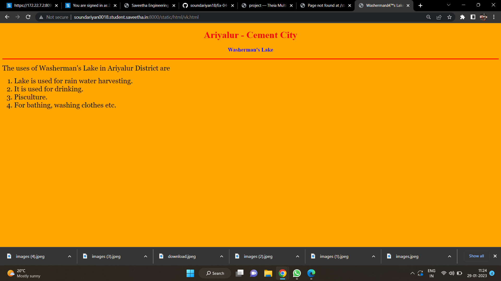
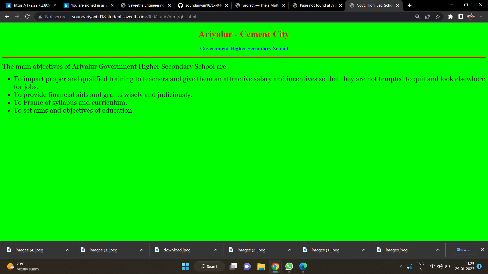
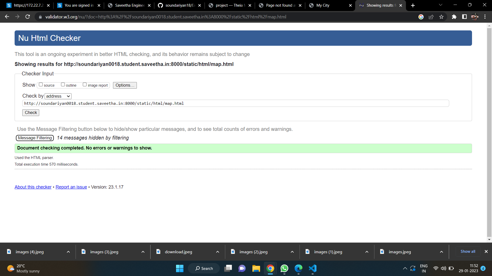

Places Around me

## aim:
To develop a website to display details about the places around my house

design steps:
## step 1

clone the github repository into theia IDE.
## step 2
create a new django project
## step 3
write the needed HTML code
## step 4
run the django server and excecute the HTML files.

code:
```html
map.html
<!DOCTYPE html>
<html lang="en">
<head>
<title>My City</title>
</head>
<body>
<h1 align="center">
<font color="red"><b>Ariyalur - Cement City</b></font>
</h1>
<h3 align="center">
<font color="blue"><b>Soundariyan M N(22008347)</b></font>
</h3>
<center>

<map name="MyCity">
<area shape="circle" coords="190,50,20" href="/static/html/ghs.html" title="Govt. Higher
Secondary School">
<area shape="rectangle" coords="230,30,260,60" href="/static/html/rto.html" title="RTO
Office">
<area shape="circle" coords="400,350,50" href="/static/html/vk.html" title="Washerman's
Lake">
<area shape="circle" coords="400,200,75" href="/static/html/bus.html" title="Hi-Tech Bus
Stand">
<area shape="rectangle" coords="490,150,870,320" href="/static/html/park.html"
title="Eco-Park">
</map>
</center>
</body>
</html>
```

```html
bus.html
<!DOCTYPE html>
<html lang="en">
<head>
<title>Bus Stand</title>
</head>
<body bgcolor="cyan">
<h1 align="center">
<font color="red"><b>Ariyalur - Cement City</b></font>
</h1>
<h3 align="center">
<font color="blue"><b>Hi-Tech Bus Stand</b></font>
</h3>
<hr size="3" color="red">
<p align="justify">
<font face="Courier New" size="5">
<b>
Ariyalur district is an administrative district, one of the 38 districts in the
state of Tamil Nadu in India. The district headquarters is located at Ariyalur.
The district encompasses an area of 1,949.31 km². Gangaikonda Cholapuram,
built by King Rajendra Cholan of Chola Empire, is a UNESCO World Heritage site
situated in this district. The district is also known for its rich prehistoric
fossils. Many fossils of gigantic molluscs and jawed fishes, at least one
fossilized dinosaur egg, and several fragmentary fossils of sauropod and theropod
dinosaurs have been discovered here. An on-site museum is being set up at
Keelapazhur to preserve and conserve fossils. Ariyalur is noted for its cement
industries and Jayankondam has huge reserves of lignite.
</b>
</font>
</p>
</body>
</html>
```

```html
park.html
<!DOCTYPE html>
<html lang="en">
<head>
<title>Eco-Park</title>
</head>
<body bgcolor="yellow">
<h1 align="center">
<font color="red"><b>Ariyalur - Cement City</b></font>
</h1>
<h3 align="center">
<font color="blue"><b>Eco-Park</b></font>
</h3>
<hr size="3" color="red">
<p align="justify">
<font face="Tahoma" size="5">
A very nice park near Ariyalur bus stand. It is located surrounding the Chetty Lake.
Very superb calm place in ariyalur. Best for walking. Nice playing place for kids.
Well maintained with jogging track. Source of ground water.
Good place play with children. In Banyan Tree lot of parrot stay like house.
Good sound and Air. Lake view park looks awesome.
Very nice place at Ariyalur.
Simple and relax with play area.
</font>
</p>
</body>
</html>
```

```html
rto.html
<!DOCTYPE html>
<html lang="en">
<head>
<title>Govt. High. Sec. School</title>
</head>
<body bgcolor="lime">
<h1 align="center">
<font color="red"><b>Ariyalur - Cement City</b></font>
</h1>
<h3 align="center">
<font color="blue"><b>Government Higher Secondary School</b></font>
</h3>
<hr size="3" color="red">
<p align="justify">
<font face="Georgia" size="5">
The main objectives of Ariyalur Government Higher Secondary School are
<ul>
<li>To impart proper and qualified training to teachers and give them an attractive
salary and incentives so that they are not tempted to quit and look elsewhere for jobs.
</li>
<li>To provide financial aids and grants wisely and judiciously.</li>
<li>To Frame of syllabus and curriculum.</li>
<li>To set aims and objectives of education.</li>
</ul>
</font>
</p>
</body>
</html>
```

```html
vk.html
<!DOCTYPE html>
<html lang="en">
<head>
<title>Washerman’s Lake</title>
</head>
<body bgcolor="orange">
<h1 align="center">
<font color="red"><b>Ariyalur - Cement City</b></font>
</h1>
<h3 align="center">
<font color="blue"><b>Washerman's Lake</b></font>
</h3>
<hr size="3" color="red">
<p align="justify">
<font face="Georgia" size="5">
The uses of Washerman's Lake in Ariyalur District are
<ol type="1">
<li>Lake is used for rain water harvesting.</li>
<li>It is used for drinking.</li>
<li>Pisculture.</li>
<li>For bathing, washing clothes etc.</li>
</ol>
</font>
</p>
</body>
</html>
```

## output:






## HTML validator


## result
the program for implementing image map is executed successfuly.
